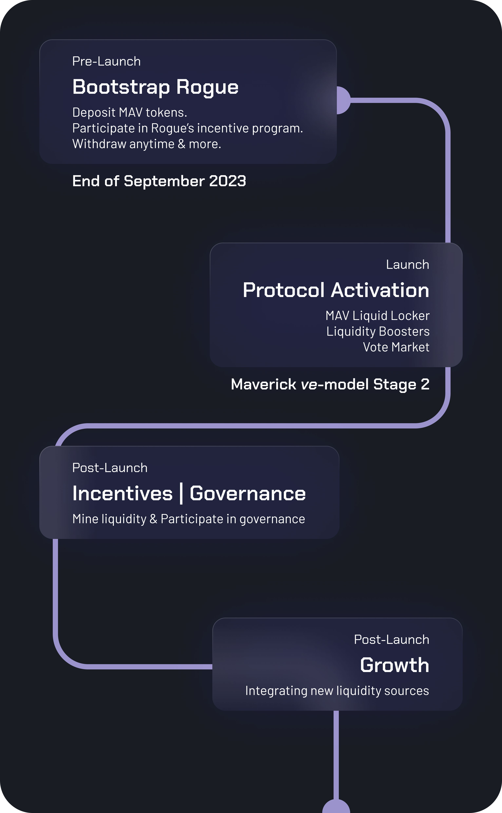

# 🚥 Roadmap

To perfectly be in phase with Maverick AMM's deployment, Rogue will launch in multiple phases.

<figure><figcaption>
What's coming?
</figcaption></figure>

### 1 **Pre-launch**

* Deposit your MAV to help bootstrap Rogue's veMAV lock. You can withdraw at anytime until a preannounced date.
* This grants you access to Rogue's gamified Incentive Program: Revolt (details TBA).
* During this phase, several features enhancing MAV deposits will be rolled out.

### 2 **Launch**&#x20;

Shortly after Maverick ve-model stage 2 goes live, Rogue will deploy the full protocol

* [**Rogue's MAV Liquid-Locker**](../../guides/rogue-for-mav-lockers.md)
* [**Rogue's Liquidity Boosters**](../../guides/rogue-for-maverick-amm-lps.md)
* [**Rogue's Vote-Market**](../../guides/vote-market.md)

### 3 **Incentives and governance (shortly after Launch Phase)**

Once Rogue has attracted liquidity, we'll uncoverRogue's native token, ROG, and how its fit in the ecosystem.

### 4 Integration with new yield sources

Rogue will integrate with new liquidity sources
